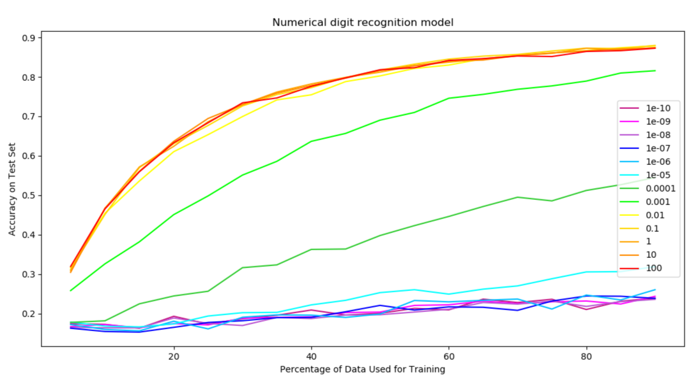

# Machine Learning Toolbox  
Software Design Machine Learning Project Toolbox  
Full instructions are on [the toolbox page](https://sd2020spring.github.io/toolboxes/machine-learning).

To run, in command prompt:
- Install scikit-learn module: `conda install matplotlib scikit-learn scipy`
- Run `python learning_curve.py`

Here is an example with 100 runs per C-value (inverse of regularization strength):  

