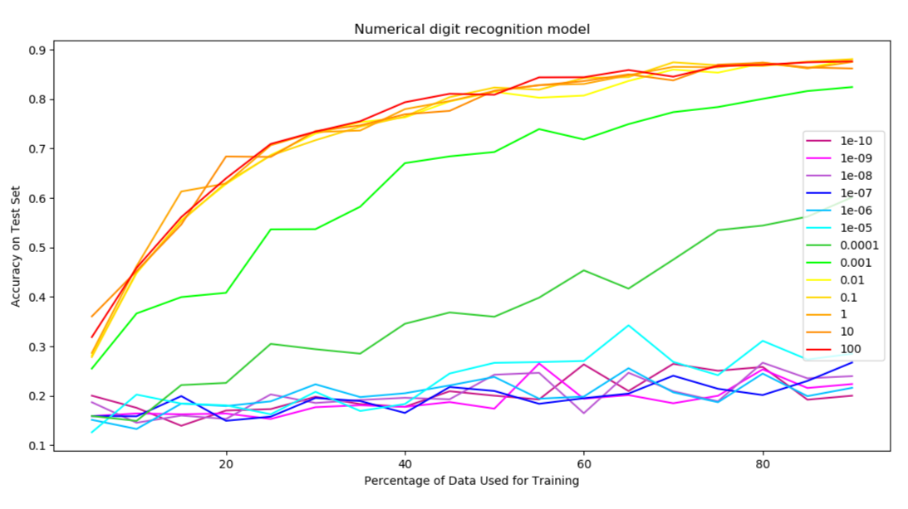
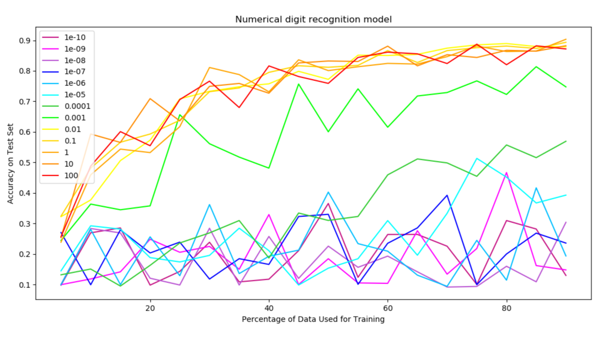

# Reflection  

1. What is the general trend in the curve?  
The trend is sort of asymptotic, seeming to converge towards 90%. When the train/test split is 50%, the best result is about 80% test accuracy, which I think is pretty good.

2. Are there parts of the curve that appear to be noisier than others? Why?  
The noise seems pretty evenly distributed even across different test/train percentage splits by my findings.

3. How many trials do you need to get a smooth curve?  
Usually around 100 runs are needed, although 1000 is even nicer. With low C-values, it isn't possible to get rid of noise.

4. Try different values for C (by changing LogisticRegression(C=10** -10)). What happens? If you want to know why this happens, see this Wikipedia page as well as the documentation for LogisticRegression in scikit-learn.  
I graphed the results with several different C values (10**-10, 10**-9, etc.) and found that the higher the C value was, the stronger the convergence and the higher the test accuracy.

Results:  
| 100 runs     |  10 runs      |  1 run     |
|:------------:|:-------------:|:----------:|
|    |    |    |
